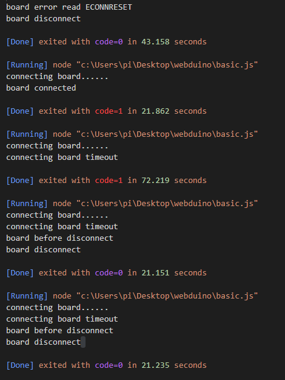
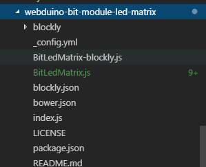
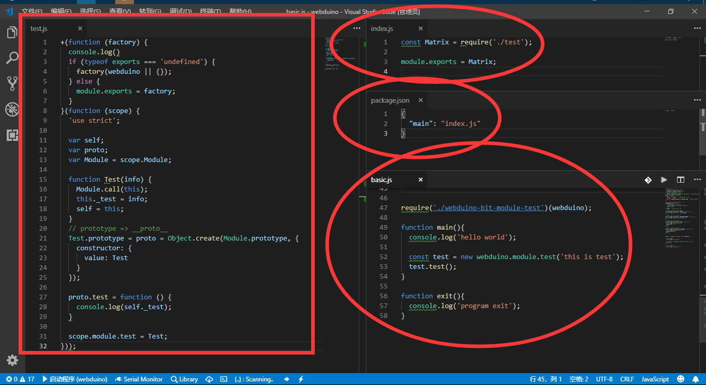
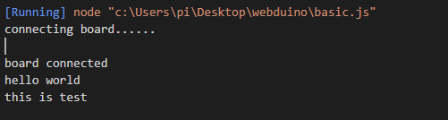
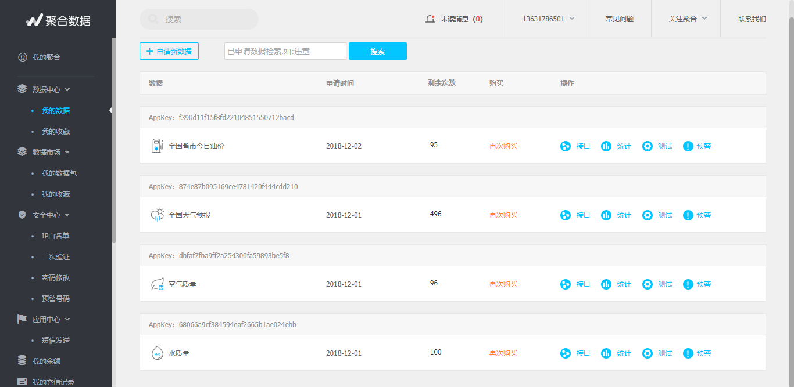
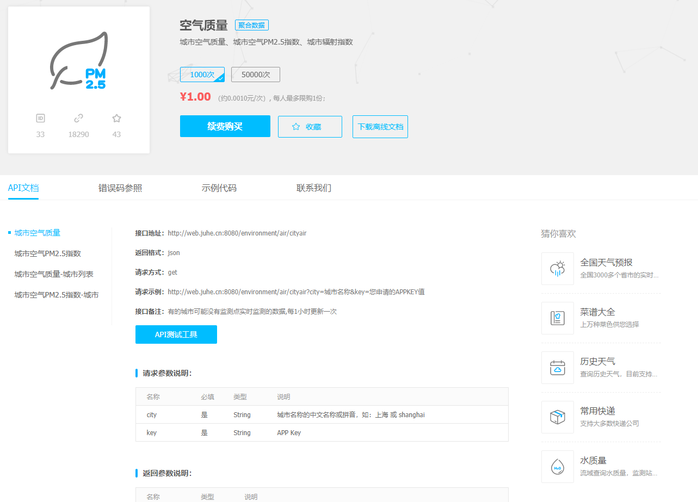
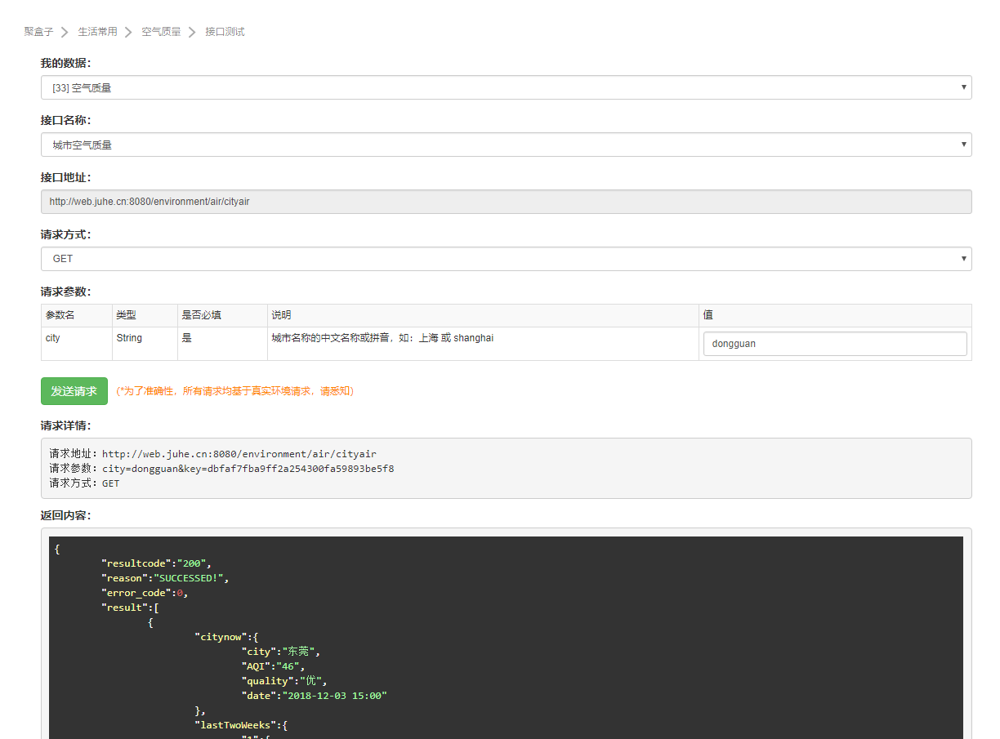
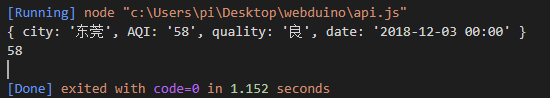
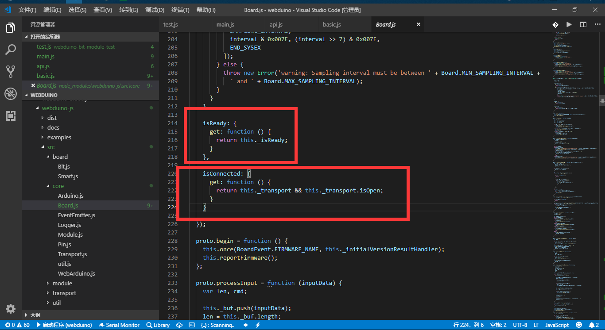
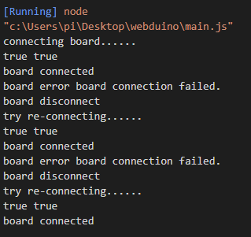

# Webduino NodeJS Development 

[TOC]

## 想做什么？

想做一个彻底云端化的物联网设备，可以时刻反馈我想要的数据，比如说，让设备实时显示指定城市的空气质量指数，又或是天气预报之类的。

让它丢在家里的桌上，给老人家没事就看一下现在外面的情况，或是看看现在的空气质量，现在适不适合出门什么的。

于是本文基于这个 Webduino-Bit 的固件来实现我的想法，通过 Node.js 的服务端方式来实现一个持续运行的 JavaScript 物联网设备。

（其实就是详细介绍一下怎么用 NodeJS 开发 webduino 软件了XD）

## 准备材料

- `一台 Windows 电脑`
- `一块 Bpi:Bit 板`
- `NodeJs v8.9.4`
- VSCODE 或 WebStorm

## 准备工作

1. 使用 Windwos 系统 WIN7 +，并插入板子确认板子驱动正常连接，无感叹号。
2. 下载[工具包](https://codeload.github.com/BPI-STEAM/BPI-BIT-WebDuino/zip/master)
3. 解压到文件夹，进入其中，先运行`AutoErase.exe`再运行`AutoFlashWebduino.exe`，具体使用方法点此查看[Auto Flash工具](https://github.com/BPI-STEAM/BPI-BIT-WebDuino/wiki#auto-flash%E5%B7%A5%E5%85%B7)。
4. 连接此处的 Bit 板子发射的热点，名称与板子滚动显示的一致，电脑扫描后连入其中，并打开`192.168.4.1`
5. 配置项目有如下
   1. WiFi SSID : 周围可上网的 WIFI 热点名称（一定是要2.4Ghz的WIFI热点）
   2. WiFi PWD : 周围可上网的 WIFI 热点密码
   3. Device ID : **bitd3d8d** 板子自动生成，需要额外记录下来
   4. Device SSID : 板子自建的热点名称
   5. Device PWD : 板子自建的热点密码
   6. MQTT Server : 选择一个服务器，在国内就选择 China，在国外就选择 Global。
   7. 确认了 SUBMIT 即可。
6. 我的配置如下 http://192.168.4.1/ap/xxxxxx/xxxxxx/bitd3d8d/bit2244/12345678/china`
7. 之后板子会滴叫一声，此时重新进入系统，面板滚动灯完毕后进入系统，如果灯面板在闪烁，则说明，没有连接上服务器，此时检查网络连接，并跳回 4，重新检查配置。
8. 安装 [NodeJs v8.9.4](https://nodejs.org/en/blog/release/v8.9.4/)
9. 确保 cmd 下运行的 node -v 等于 v8.9.4，说明 nodejs 已经安装完成。
10. 进一步确认 npm -v，如果没有报错，则说明，npm 已经安装完成。
11. 安装 VSCODE 或 WebStorm，后者不需要看 10 项。
12. 打开 VSCODE，新建 nodejs 项目并运行，VSCODE 推荐安装拓展 `Code Runner`，可以直接右键运行代码。
13. 准备一个 basic.js 空白文件，做为基础应用示例代码，下面会提供具体内容。
14. 在项目终端中使用 `npm install webduino-js` 即可完成基础库的安装。

## 开始编程

### 一个基础的代码

以下代码在 `demo-0.js` 文件中。

```javascript
'use strict';
// 获取调用的依赖 webduino-js 库
var webduino = require('webduino-js');
// 板子控制变量，以及是否连接的标记
var board, isconnected = false;
// 设定板子的信息，它会后台自动连接 MQTT 服务器，与板子建立连接。
board = new webduino.Arduino({
  'board': 'Bit',
  'device': 'bitd3d8d', // 你板子的 Device ID 号
  'transport': 'mqtt',
  'server': webduino.WebArduino.SERVER_CHINA, // DEFAULT_SERVER // 中国服务器和外国服务器
});

console.log('connecting board......');
setTimeout(function () {
  if (isconnected == false) {
    console.log('connecting board timeout');
    board.close();
  }
}, 20000); // 设定 20s 连接超时

// 板子连接成功后 会运行此函数
board.on(webduino.BoardEvent.READY, function () {
  console.log('board connected');
  isconnected = true;
});

// 板子连接过程中出错 会运行此函数
board.on(webduino.BoardEvent.ERROR, function (err) {
  console.log('board error', err.message);
});

// 板子断开连接前 会运行此函数
board.on(webduino.BoardEvent.BEFOREDISCONNECT, function () {
  console.log('board before disconnect');
});

// 板子断开连接后 会运行此函数
board.on(webduino.BoardEvent.DISCONNECT, function () {
  console.log('board disconnect');
  board.disconnect();
});

```

这个代码是为了运行环境与板子的连接，运行效果如图。



连接不上的情况有这几种。

1. 板子反复亮红屏，表示板子没有连接上服务器，所以本地会显示`connecting board timeout`，表示连接到板子超时断开，尽管连接到了服务器，但不代码正常与板子建立连接。
2. 板子没有亮红屏，表示板子连上服务器，此时仍然显示 `connecting board timeout` ，说明本地网络环境连接不到服务器，连接不到服务器的原因有如下几种。
   1. 两者服务器的选取不一致，分`SERVER_CHINA` 和 `DEFAULT_SERVER`，也就是国内和国际服务器。
   2. 开发环境中的网络环境无法连接到服务器，尤其是国际服务器。

正常连接成功，将会显示 `board connected`，网络环境良好的情况下，只需在几秒内即可完成连接。

在连接过程中，如果出现 `board disconnect` 则表示板子断开或服务器断开，应检查是哪一端断开，并且能在 `board  before disconnect` 的时候，再决定，是断开还是检查后恢复连接。

现在我们已经知道怎么开始连接我们板子的信息了。

根据代码可以知道四种基本连接情况，分为以下四种事件触发。

1. webduino.BoardEvent.READY // 板子连接成功后 会运行此函数
2. webduino.BoardEvent.ERROR // 板子连接过程中发生错误 会运行此函数
3. webduino.BoardEvent.BEFOREDISCONNECT // 板子断开连接之前 会运行此函数
4. webduino.BoardEvent.DISCONNECT // 板子断开连接后 会运行此函数

如果你不需要这些，你也可以只用事件 1 和 4 即可开始基本编程。

代码也就可以简化成如下这样：

```javascript
'use strict';
// 获取调用的依赖 webduino-js 库
var webduino = require('webduino-js');
// 板子控制变量，以及是否连接的标记
var board, isconnected = false;
// 设定板子的信息，它会后台自动连接 MQTT 服务器，与板子建立连接。
board = new webduino.Arduino({
  'board': 'Bit',
  'device': 'bitd3d8d', // 你板子的 Device ID 号
  'transport': 'mqtt',
  'server': webduino.WebArduino.SERVER_CHINA, // DEFAULT_SERVER // 中国服务器和外国服务器
});

console.log('connecting board......');
setTimeout(function () {
  if (isconnected == false) {
    console.log('connecting board timeout');
    board.close();
  }
}, 20000); // 设定 20s 连接超时

// 板子连接成功后 会运行此函数
board.on(webduino.BoardEvent.READY, function () {
  console.log('board connected');
  isconnected = true;
  main();
});

// 板子断开连接后 会运行此函数
board.on(webduino.BoardEvent.DISCONNECT, function () {
  console.log('board disconnect');
  board.disconnect();
  exit();
});

function main(){
  console.log('hello world');
}

function exit(){
  console.log('program exit');
}

```

以上代码在 `demo-1.js` 文件中。

此时你也就只需要关注 main 和 exit 函数即可。

### 检查硬件基础功能

假设连接成功后，则试着操作一下硬件，确保与硬件连接的通路都正常，找一个 LED 来核对一下吧。

有如下代码：(以下代码在 `demo-2.js` 文件中)

```javascript

function main(){
  console.log('hello world');

  var led_no = 18;
  var led = new webduino.module.Led(board, board.getDigitalPin(led_no));
  led.blink(500);
  console.log('blink led ' + led_no);
}

function exit(){
  console.log('program exit');
}
```

那么就简单拓展一下，添加更多引脚（25、33）来设置多个 LED，且不同时刻运行的跑马灯效果。

则代码如下：（以下代码在 `demo-3.js` 文件中）

```javascript
function led_bink(led_no){
  var led = new webduino.module.Led(board, board.getDigitalPin(led_no));
  led.blink(500);
  console.log('blink led ' + led_no);
}

function main(){
  console.log('hello world');
  setTimeout(function () { led_bink(18); }, 1000);
  setTimeout(function () { led_bink(32); }, 1500);
  setTimeout(function () { led_bink(33); }, 2000);
}

function exit(){
  console.log('program exit');
}
```

最后这些有关硬件的操作，是原本就在固件里存在的控制协议，也就是说， 只需要上下层的协议（*Firmata*）应用对上去就可以用了，那么，怎么拓展到其他应用呢？下一章就对此进行说明。

### 拓展模块示例应用

使用先前的模块我们只能操作内置的一些基本控制协议，它无法完全适应我们的版型，所以我们需要从这里取 [led-matrix](https://github.com/webduinoio/webduino-bit-module-led-matrix) ，这是一个 Led 面板灯的控制，我们以此为例，它是对原来的拓展，比如我们刚才用的 `webduino.module.Led`，是一个内部内置的模块，而 对于我现在使用的版型，则需要额外下载，并对它依葫芦画瓢可知，其他模块也是这样封装而成。

```shell
npm install webduino-bit-module-led-matrix
```

使用以上命令获取官方做的拓展库，它的模块名称为 `webduino-bit-module-led-matrix`。

#### Usage

```javascript
let webduino = require('webduino-js');
require('webduino-bit-module-led-matrix')(webduino);

const opts = {
  board: 'Bit',
  device: 'device_id',
  transport: 'mqtt'
};

let board = new webduino.board[opts.board](opts);

board.once(webduino.BoardEvent.READY, (board) => {
  board.samplingInterval = 250;
  const matrix = new webduino.module.Matrix(board, 4, 25);
  matrix.setCharacter('1', '#ffff66');
});
```

如果是在先前的基础上进行补充的话，可以写成如下代码。

```javascript
require('webduino-bit-module-led-matrix')(webduino); // 引入库到 webduino 的核心里

function main() {
    console.log('hello world');

    board.samplingInterval = 250;
    const matrix = new webduino.module.Matrix(board, 4, 25); // 配置 Bit 版型的 Led Matrix 对应引脚。
    matrix.setCharacter('1', '#ffff66'); // 显示单个字符
    matrix.setString('Hello the world.', '#ff0000', 1); // 显示字符串，可以从 blockly 里中获取得到对应的代码。
}

function exit() {
    console.log('program exit');
}
```

以上代码在 `demo-4.js` 文件中。

运行后会出现白色的 1 表示运行成功，最后，测试模块的时候要尽可能简单纯粹，减少问题出现的变量。

### 添加更多模块应用

既然我们知道如何下载添加了一个拓展库，那么我们来自制一个拓展库吧，我们可以在原来的基础上进行改造封装就可以理解它的原理和必要条件了，以下所有的操作都是最精简的必须操作。

在 `basic.py` 同目录下，新建一个 nodejs 模块需要经过以下步骤：

1. 新建一个文件夹，名为 `webduino-bit-module-test`，可以任意改动，它只和代码 `require('./webduino-bit-module-test')(webduino);` 有关。

2. 在里面添加两个必须的文件，和一个借用的文件（来自上一章的  `led-matrix` 模块）。

   1. 在文件夹里 `package.json`，其内容如下，表示该 NodeJS 模块的入口为 `index.js`。

      - ```json
        {
          "main": "index.js"
        }
        ```

   2. 由于前一步骤指出了需要 `index.js`，则在同一目录下新建它，这是该模块的初始化入口引导，其内容可以如下，表示需要引用本地的 `BitLedMatrix.js` 文件，但这个文件哪里来呢？继续下一步骤可知。

      - ```javascript
        const matrix = require('./BitLedMatrix');
        module.exports = matrix;
        ```

   3. 我们现在需要添加的是`BitLedMatrix.js`这个文件，而这个文件来自于`node_modules/webduino-bit-module-led-matrix`，使用 NPM 就会生成 `node_modules`，下载的依赖包都会被安装到这里，而我为了说明它的包机制，从它的目录下取出了`BitLedMatrix.js`这个文件。

      - 
      - 现在复制到 `webduino-bit-module-test` 目录下，注意不放在 `node_modules` ，而是它的上一级目录，和 `basic.js`同级，这只是会导致在调用的时候要特别指定路径是相对还是绝对。

   4. 现在使用以下代码调用我们的新模块。

      - ```javascript
        
        require('./webduino-bit-module-test')(webduino);
        
        function main(){
          console.log('hello world');
        
          board.samplingInterval = 250;
          const matrix = new webduino.module.Matrix(board, 4, 25);
          matrix.setCharacter('1', '#ffff66');
          matrix.setString('Hello the world.', '#ff0000', 1);
        }
        
        function exit(){
          console.log('program exit');
        }
        ```

      - 和先前不同的地方在于包的获取变成了`./webduino-bit-module-test'`，这表示已经在调用我们自己自制的包了。

   5. （拓展修改）如果我们不希望与原来的模块名 `webduino.module.Matrix`冲突，那现在我们可以继续修改源代码，将其变成`new webduino.module.test(board, 4, 25);`，这需要修改两个文件，一个是暴露的模块属性`exports`，另一个是模块里属性对应的名称`module.xxxx`。

      1. 修改 `index.js` 的 `matrix` 为 `test`。

         - ```javascript
           const test = require('./test');
           module.exports = test;
           ```

      2. 只需要修改 `BitLedMatrix.js` 的 `scope.module.matrix` （一般在末尾）为 `scope.module.test`，这表示暴露出去的模块变量为`test`，从而调用的时候，使用的是`webduino.module.test`。

   6. 如果只是修改其中一处，运行时将会抛出异常，提示 XXX 不是一个构造器，这意味着，该模块的名称没有与属性（prototype）绑定在一起，所以会报出`TypeError: XXXX is not a constructor`的错误信息，这需要进一步学习 JavaScript 的构造函数才能理解原理。

既然我们已经准备好一个属于自己的模块文件了，那我们现在就可以开发我们自己的模块内容了。

### 设计自定义的模块



在先前的基础上，自己做一个属于自己的模块文件，代码文件`test.js`如下。

```javascript
+(function (factory) {
  console.log()
  if (typeof exports === 'undefined') {
    factory(webduino || {});
  } else {
    module.exports = factory;
  }
}(function (scope) {
  'use strict';

  var self;
  var proto;
  var Module = scope.Module;

  function Test(info) {
    Module.call(this);
    this._test = info;
    self = this;
  }
  
  // prototype => __proto__
  Test.prototype = proto = Object.create(Module.prototype, {
    constructor: {
      value: Test
    }
  });

  proto.test = function () {
    console.log(self._test);
  }

  scope.module.test = Test;
}));
```

对应调用的代码文件`basic.js`如下：

```javascript
require('./webduino-bit-module-test')(webduino);

function main(){
  console.log('hello world');

  const test = new webduino.module.test('this is test');
  test.test();
}

function exit(){
  console.log('program exit');
}
```

这便是在先前的基础上，自己做了一个属于自己的模块文件。

运行结果如下：



输出显示 `this is test`表示调用`test.test();`代码的结果。

```javascript
const test = new webduino.module.test('this is test');
test.test();
```

稍微解释一下有如下代码关系。

```javascript
  function Test(info) {
    Module.call(this);
    this._test = info;
    self = this;
  }

  proto.test = function () {
    console.log(self._test);
  }
```

原理就是将 `test` 属性绑定到一个函数上，所以才可以被实例化对象调用执行出来。

### 在云服务上做结合

在 NodeJS 中发起 HTTP 的请求需要借助一下外部模块的力量，有利于我们快速开发和应用。

使用 `npm install request`来安装拓展依赖库（也可以用 request-json）。

使用下面这段函数做为发起 HTTP 请求基础的代码。

```javascript
var request = require('request');
request({
    json: true,
    url: 'http://baidu.com',
}, function (error, response, body) {
    if (!error && response.statusCode == 200) {
        console.log(body);
    }
});
```

然后我们准备一段可以获取东莞城市里的各大镇区的空气质量指数的 API 接口获取数据，如下代码：

```javascript
var request = require('request');
request({
    json: true,
    url: 'http://web.juhe.cn:8080/environment/air/cityair?' + require('querystring').stringify({
        city: 'dongguan', // 东莞
        key: "dbfaf7fba9ff2a254300fa59893be5f8" // 私人密钥，可以自己去申请。
    }),
}, function (error, response, body) {
    if (!error && response.statusCode == 200) {
        console.log(body);
    }
});
```

这端代码所用的 API 是通过从 [聚合数据平台](https://www.juhe.cn/myData) 提供的接口得来，如下图：



像我拿一个空气质量的来测试一下。



测试效果如下，确认可行了，就把这段路径提取到自己的程序中，当然你也可以直接在浏览器中访问获取数据。



它是一些个人免费使用的接口，此外也同样可以使用其他的 API 平台，而我仅是借此实例简单说明如何操作。

```javascript
if (!error && response.statusCode == 200) {
    // console.log(body);
    if (body['reason'] == 'SUCCESSED!') {
        console.log(body['result'][0]['citynow']);
        console.log(body['result'][0]['citynow']['AQI']);
    }
}
```

通过以上代码（在 api.js 文件）的解析，我们可以得到以下结果。



其中我们可以知道`body['result'][0]['citynow']['AQI']`是为了提取其中的 AQI 指数（环境空气质量标准），至此我们已经成功通过 NodeJS 来从云端获取了数据。

### 硬件接收云端数据

之前我们已经可以获取的云端的数据了，那么现在我们进一步反馈给硬件显示查看吧，利用先前使用的 `led-matrix` 模块来结合新的 `test` 模块。

为我们的 test 模块添加一个属性函数，它可以让模块通过 `test.AQI();` 的方式来调用返回结果。

```javascript
  proto.AQI = function (City, callback) {
    var request = require('request');
    request({
      json: true,
      url: 'http://web.juhe.cn:8080/environment/air/cityair?' + require('querystring').stringify({
        city: City,
        key: "dbfaf7fba9ff2a254300fa59893be5f8" // 私人密钥
      }),
    }, callback);
  }
```

再来就是两两结合，注意调用方法是回调的方式，因为是异步驱动的模型，所以当远端数据到位了，自然会显示对应的数据出来到板子上，如下代码可知。

```javascript
require('webduino-bit-module-led-matrix')(webduino);

require('./webduino-bit-module-test')(webduino);

function main() {
  console.log('hello world');

  const test = new webduino.module.test('this is test');
  test.AQI('dongguan', function (error, response, body) {
    if (!error && response.statusCode == 200) {
      // console.log(body);
      if (body['reason'] == 'SUCCESSED!') {
        console.log(body['result'][0]['citynow']);

        var aqi = body['result'][0]['citynow']['AQI'];

        board.samplingInterval = 250;
        const matrix = new webduino.module.Matrix(board, 4, 25);
        matrix.setString('AQI-' + aqi, '#00cccc', 1);
      }
    }
  });
}
```

可以看到 Bit 板反复显示现在所获取云端提供的东莞城市空气质量指数，同理其他 API 亦如此。

### 程序接收硬件反馈

现在我们已经可以控制板子了，但板子的情况我们要如何得知呢？

这将用到板子上的两个按键来反馈给上层了，这时候也同前几节的方式应用拓展模块 [webduino-bit-module-button](https://github.com/webduinoio/webduino-bit-module-button)，使用 `npm install webduino-bit-module-button` 安装拓展模块，则有如下用法。

#### Usage

```javascript
let webduino = require('webduino-js');
require('webduino-bit-module-button')(webduino);

const opts = {
  board: 'Bit',
  device: 'device_id',
  transport: 'mqtt'
};
  
let board = new webduino.board[opts.board](opts);

board.once(webduino.BoardEvent.READY, (board) => {
  board.samplingInterval = 250;
  const btnA = new webduino.module.Button(board, board.getDigitalPin(35), webduino.module.Button.PULL_UP);
  btnA.on("pressed", () => console.log('pressed'));
});
```

我相信这一次，你也应该很快就会用起来了吧，需要注意的地方是`btnA.on("pressed", () => console.log('pressed'));`，这是一个匿名函数`() => xxxx();` 这意味着在任何时候，只底层满足了这个条件反馈给顶层了，顶层将会在任何时候都有可能触发执行 `console.log('pressed')` 函数，因为 JS 是异步事件驱动的，虽然这章的代码并没有办法截图演示，但我想，经过了前面的使用方式，这里对你来说应该不是什么大难题，对吧？

```javascript

require('webduino-bit-module-button')(webduino);

function main() {
    console.log('hello world');
    
    board.samplingInterval = 250;
    const btnA = new webduino.module.Button(board, board.getDigitalPin(35), webduino.module.Button.PULL_UP);
    btnA.on("pressed", () => console.log('pressed'));
}

function exit() {
    console.log('program exit');
}
```

以上代码提供在 demo-5.js 文件。

### 进行可靠性再封装

最后我们不难发现，一旦网络不稳定，连接不稳定或断开的时候，程序将会断开退出程序，这显然是不够可靠的，所以我们要能让它断开后自动重连即可保证它的持续运行。

当到了这一章的时候，请注意到现在的你回过头去看 `webduino-js` 模块，我相信你是可以看懂的了，包括过去不理解的接口和函数绑定，现在你会发现，在 `webduino-js` 模块中的 `src/core/Board.js` 中，有更多可以使用的属性和对象供你挑选，则你可以对这个可靠性封装做一次提升，而不是单纯的判断是否断开连接。



如上图所指示的框，可以看到它内部具有的一些提前预置好的属性，这些属性可以帮助你直接判断底层情况，而不是最初使用一个 `isconnected` 变量暂存的方式来判断，所以提出我们至少还需要在额外补充定时守护（ daemon）板子连接与就绪状态的函数，而不是重新运行程序或让程序直接退出。

如果是再部署运维的时候，至少还需要再添加对应的 Js 文件守护程序，因此，现在有如下代码。

```javascript
'use strict';
var webduino = require('webduino-js');
var board;

function daemon_server() {
    board = new webduino.Arduino({
        'board': 'Bit',
        'device': 'bitd3d8d',
        'transport': 'mqtt',
        'server': webduino.WebArduino.SERVER_CHINA,
    });

    board.on(webduino.BoardEvent.ERROR, function (err) {
        console.log('board error', err.message);
    });

    board.on(webduino.BoardEvent.DISCONNECT, function () {
        console.log('board disconnect');
    });

    board.on(webduino.BoardEvent.READY, function () {
        console.log(board.isConnected, board.isReady);
        console.log('board connected');
        main();
    });

    console.log('connecting board......');
    setTimeout(function () {
        if (board.isConnected == false) {
            console.log('connecting server fail');
            board.close();
        }
        if (board.isReady == false) {
            console.log('connecting board fail');
            board.close();
        }
    }, 5000);
    
}

daemon_server();

setInterval(function () {
    // console.log(board.isConnected, board.isReady);
    if (typeof (board.isConnected) == "undefined") {
        console.log("try re-connecting......");
        daemon_server();
    }
}, 10000);

function main() {
  console.log('hello world');
}

```

现在，程序的连接会更加牢固了，因此作为服务程序也是可以持续运行的了，但也许在配置项中的 `autoReconnect` 这个选项已经包含了这个功能吧。



### 写在最后的话

阅读到这里了，我想你应该知道怎么去理解底层源码了吧，可据此文依葫芦画瓢，然后开始你的开发之旅吧。

但我相信一些原理的东西，你可能还不太可以接受，尽管你有其他语言的基础，但这里的 NodeJS 不仅是 JavaScript 语言那么直白的东西，它包括各类 ES 标准，一些高级语言特性，一些不同于过去的语法糖特性，已经不能用单纯的浏览器 JavaScript 脚本语言去理解它这个新事物了，所以继续加油吧，相信你已经成功进入到了专业的开发队伍当中了。
